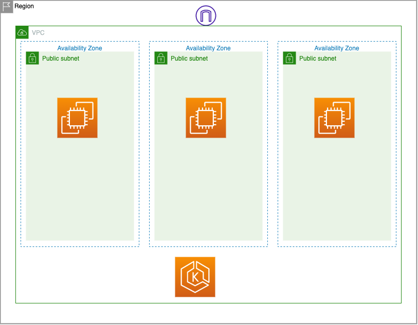
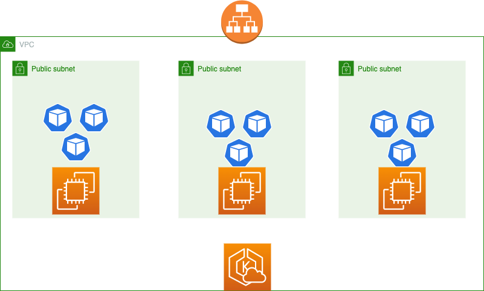

# demo-public

## IaC GitOps



## Application GitOps



## ArgoCD structure

```
├── application
│   └── ap-southeast-1
│       ├── managed
│       │   ├── apps
│       │   │   ├── argo-rollout.yaml
│       │   │   ├── argocd.yaml
│       │   │   ├── atlantis.yaml
│       │   │   ├── http-echo.yaml
│       │   │   ├── linkerd-viz.yaml
│       │   │   ├── linkerd.yaml
│       │   │   └── minimalapp.yaml
│       │   ├── base
│       │   │   ├── argocd-project.yaml
│       │   │   └── manifests.yaml
│       │   └── infra
│       │       ├── cert-manager.yaml
│       │       ├── crossplane.yaml
│       │       ├── external-dns.yaml
│       │       ├── ingress-public.yaml
│       │       └── linkerd
│       │           ├── linkerd-crds.yaml
│       │           ├── linkerd-viz.yaml
│       │           └── linkerd.yaml
│       └── manifests
│           ├── ProviderInstall.yaml
│           ├── app-rollout-demo.yaml
│           ├── argocd.yaml
│           ├── cert-manager.yaml
│           ├── linkerd.yaml
│           ├── postgres.yaml
│           ├── providerawsconfig.yaml
│           └── s3-test-bucket.yaml
```
